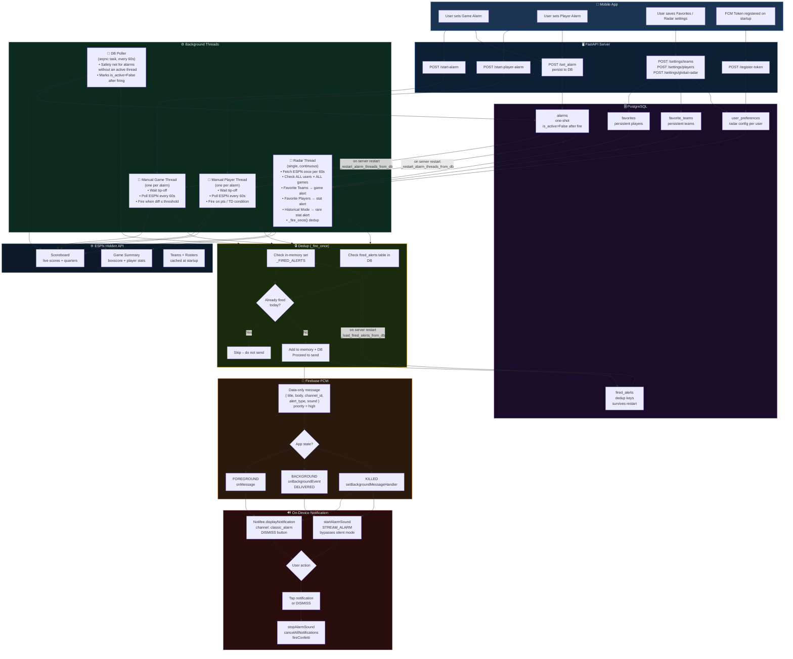

## NBA Smart Alarm – System Flow

Paste this into https://mermaid.live

```mermaid
flowchart TD
    %% ── MOBILE APP ──
    subgraph MOBILE["📱 Mobile App"]
        A1[User sets Game Alarm]
        A2[User sets Player Alarm]
        A3[User saves Favorites / Radar settings]
        A4[FCM Token registered on startup]
    end

    %% ── API ──
    subgraph API["🖥️ FastAPI Server"]
        B1[POST /start-alarm]
        B2[POST /start-player-alarm]
        B3[POST /set_alarm\npersist to DB]
        B4[POST /register-token]
        B5[POST /settings/teams\nPOST /settings/players\nPOST /settings/global-radar]
    end

    %% ── THREADS ──
    subgraph THREADS["⚙️ Background Threads"]
        C1["🏀 Manual Game Thread\n(one per alarm)\n• Wait tip-off\n• Poll ESPN every 60s\n• Fire when diff ≤ threshold"]
        C2["👤 Manual Player Thread\n(one per alarm)\n• Wait tip-off\n• Poll ESPN every 60s\n• Fire on pts / TD condition"]
        C3["📡 Radar Thread\n(single, continuous)\n• Fetch ESPN once per 60s\n• Check ALL users × ALL games\n• Favorite Teams → game alert\n• Favorite Players → stat alert\n• Historical Mode → rare stat alert\n• _fire_once() dedup"]
        C4["🔄 DB Poller\n(async task, every 60s)\n• Safety net for alarms\n  without an active thread\n• Marks is_active=False after firing"]
    end

    %% ── DEDUP ──
    subgraph DEDUP["🔒 Dedup (_fire_once)"]
        D1[Check in-memory set\n_FIRED_ALERTS]
        D2[Check fired_alerts table in DB]
        D3{Already fired\ntoday?}
        D4[Skip – do not send]
        D5[Add to memory + DB\nProceed to send]
    end

    %% ── FCM ──
    subgraph FCM["🔔 Firebase FCM"]
        E1["Data-only message\n{ title, body, channel_id,\n  alert_type, sound }\npriority = high"]
        E2{App state?}
        E3[FOREGROUND\nonMessage]
        E4[BACKGROUND\nonBackgroundEvent\nDELIVERED]
        E5[KILLED\nsetBackgroundMessageHandler]
    end

    %% ── NOTIFICATION ──
    subgraph NOTIF["🔊 On-Device Notification"]
        F1[Notifee.displayNotification\nchannel: classic_alarm\nDISMISS button]
        F2[startAlarmSound\nSTREAM_ALARM\nbypasses silent mode]
        F3{User action}
        F4[Tap notification\nor DISMISS]
        F5[stopAlarmSound\ncancelAllNotifications\nfireConfetti]
    end

    %% ── DATABASE ──
    subgraph DB["🗄️ PostgreSQL"]
        G1[alarms\none-shot\nis_active=False after fire]
        G2[favorites\npersistent players]
        G3[favorite_teams\npersistent teams]
        G4[user_preferences\nradar config per user]
        G5[fired_alerts\ndedup keys\nsurvives restart]
    end

    %% ── ESPN ──
    subgraph ESPN["🌐 ESPN Hidden API"]
        H1[Scoreboard\nlive scores + quarters]
        H2[Game Summary\nboxscore + player stats]
        H3[Teams + Rosters\ncached at startup]
    end

    %% ── CONNECTIONS ──
    A1 --> B1
    A1 --> B3
    A2 --> B2
    A2 --> B3
    A3 --> B5
    A4 --> B4

    B1 --> C1
    B2 --> C2
    B3 --> G1
    B4 --> G4
    B5 --> G2
    B5 --> G3
    B5 --> G4

    C1 --> H1
    C2 --> H1
    C2 --> H2
    C3 --> H1
    C3 --> H2
    C4 --> H1
    C4 --> G1

    G4 --> C3
    G2 --> C3
    G3 --> C3

    C1 --> DEDUP
    C2 --> DEDUP
    C3 --> DEDUP
    C4 --> DEDUP

    D1 --> D3
    D2 --> D3
    D3 -->|Yes| D4
    D3 -->|No| D5

    D5 --> E1
    D5 --> G5

    E1 --> E2
    E2 --> E3
    E2 --> E4
    E2 --> E5

    E3 --> F1
    E4 --> F2
    E5 --> F1
    E5 --> F2

    F1 --> F3
    F2 --> F3
    F3 --> F4
    F4 --> F5

    %% ── SERVER RESTART RECOVERY ──
    G1 -->|"on server restart\n_restart_alarm_threads_from_db"| C1
    G1 -->|"on server restart\n_restart_alarm_threads_from_db"| C2
    G5 -->|"on server restart\n_load_fired_alerts_from_db"| D1

    %% ── STYLES ──
    style MOBILE fill:#1a3451,stroke:#4d8cf5,color:#e6edf3
    style API fill:#0d1f35,stroke:#4d8cf5,color:#e6edf3
    style THREADS fill:#0d2a1f,stroke:#3fb950,color:#e6edf3
    style DEDUP fill:#1a2a0d,stroke:#f0a500,color:#e6edf3
    style FCM fill:#2a1a0d,stroke:#FF6B00,color:#e6edf3
    style NOTIF fill:#2a0d0d,stroke:#c9082a,color:#e6edf3
    style DB fill:#1a0d2a,stroke:#9b59b6,color:#e6edf3
    style ESPN fill:#0d1a2a,stroke:#6b8aad,color:#e6edf3
```
